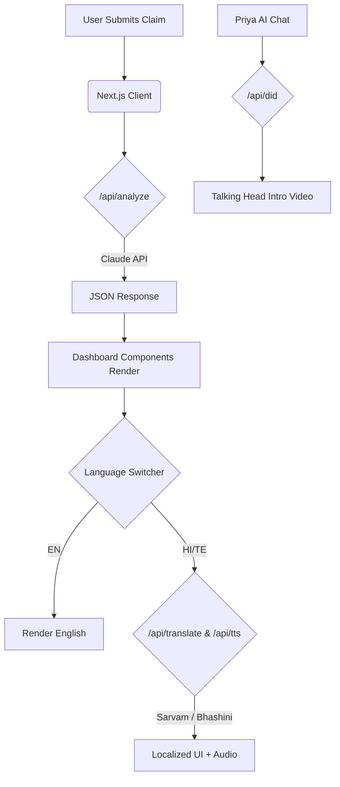

# TruthLens 🔍

**TruthLens** is an AI-powered forensic fact-checking dashboard that analyzes claims, cross-references sources, and delivers transparent verdicts. Built for hackathons, production environments, and journalism integrity.

## 🌟 Key Features

- **Forensic Matrix Engine**: Powered by Claude Sonnet, analyzes raw text and URLs against predefined schemas to output structured JSON with verdicts, bias scores, and red flags.
- **Dynamic Credibility Scoring**: Real-time gauge visualization tracking source reliability and cross-referencing contradictions.
- **Multilingual Support**: Fully localized in English, Hindi (हिन्दी), and Telugu (తెలుగు) using Sarvam AI and Bhashini API.
- **Priya AI Journalist**: A conversational investigative AI assistant with D-ID powered talking head generation and native text-to-speech support.
- **Cyber-Professional UI**: Modern glassmorphism aesthetics, built with Tailwind CSS v4 and Framer Motion.

## 🚀 Quick Start

1. **Clone & Install**
   ```bash
   git clone https://github.com/your-username/truthlens.git
   cd truthlens
   npm install
   ```

2. **Environment Variables**
   Copy `.env.local.example` to `.env.local`:
   ```bash
   cp .env.local.example .env.local
   ```
   Add your API keys. If you just want to test the UI without API keys, set `NEXT_PUBLIC_DEV_MODE=true`.

3. **Run Development Server**
   ```bash
   npm run dev
   ```
   Navigate to `http://localhost:3000`

## 🔑 API Key Requirements

| Service | Usage | Required | Free Tier |
|---------|-------|----------|-----------|
| **Anthropic (Claude)** | Core fact-checking analysis (`/api/analyze`) | ✅ Yes | Free trial credits |
| **Sarvam AI** | Hindi/Telugu Translation & TTS (`/api/translate`, `/api/tts`) | ⚠️ Recommended | Free developer tier |
| **Bhashini API** | Free Government API fallback for Translation & TTS | ⚠️ Backup | 100% Free |
| **D-ID API** | Talking head generation for Priya AI (`/api/did`) | ❌ Optional | 20 free credits |

## 🏗 Architecture



## 🛠 Tech Stack

- **Framework**: Next.js 14 App Router
- **Language**: TypeScript
- **Styling**: Tailwind CSS v4, Framer Motion
- **AI/APIs**: Anthropic Claude, Sarvam AI, Bhashini, D-ID

---
Built with ❤️ for truth.
